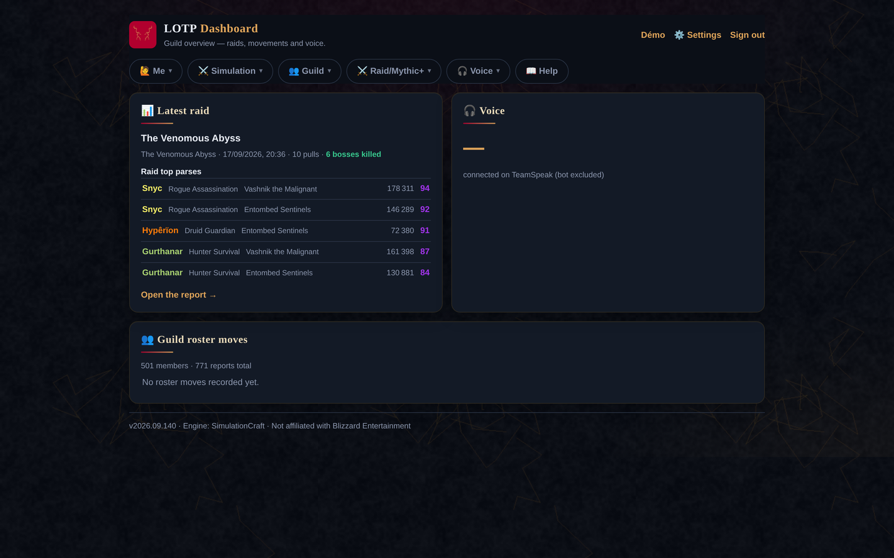
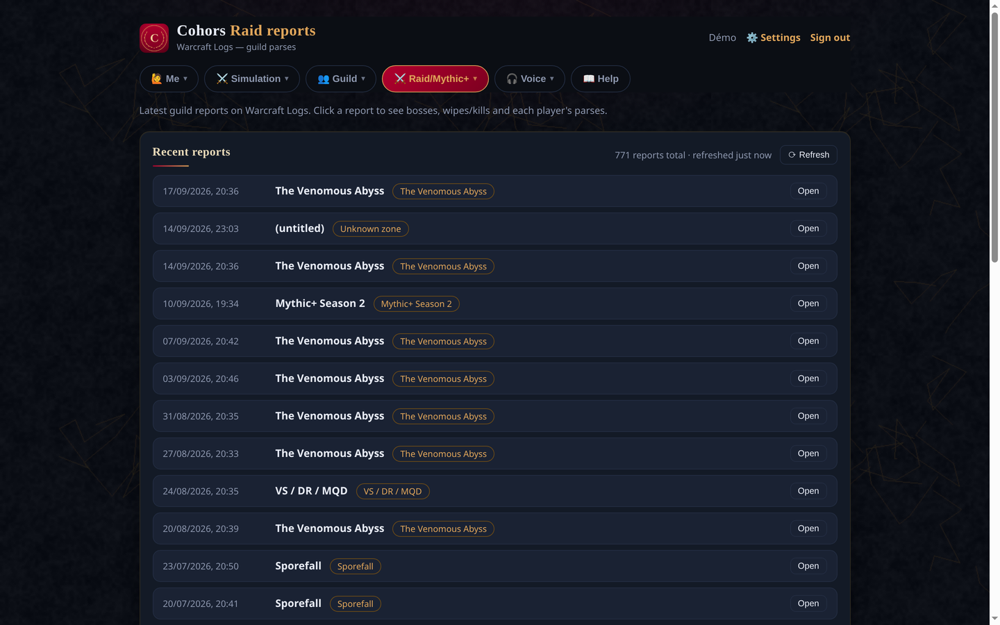
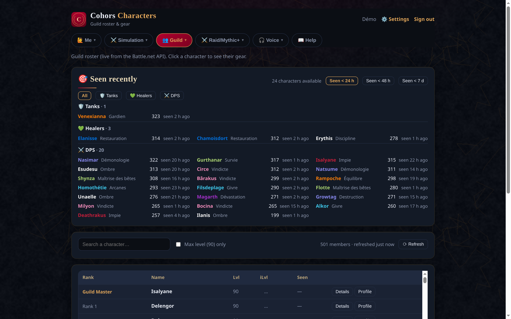

<p align="center"></p>

# Cohors

**Guild companion for World of Warcraft — self-hosted.** SimulationCraft simulations,
gear advice, raid preparation, Warcraft Logs reports, roster tracking, crafting, wishlist,
guild calendar and Discord announcements — one web app, one instance per guild.

**Live demo:** https://cohors.cloudfr.net ·
**Releases:** https://github.com/LostInTheBugs/cohors/releases

> Not affiliated with Blizzard Entertainment, Inc. Game data is provided by Blizzard
> Entertainment and by Warcraft Logs. Simulations run on the official SimulationCraft
> engine (Docker image).

## Screenshots







## Features

- **Simulator** — paste your in-game `/simc` export: DPS simulations through the official
  SimulationCraft image, stat-weights mode, sim profiles (save once, reload in one click),
  group simulations (combine members' profiles with raid buffs).
- **Gear advice** — « Top Stuff » (simulate Wowhead items on your character, ranked by DPS),
  « Stuff conseillé » (what to wear among what you already own — three modes: current pieces,
  every piece at its maximum upgrade rank, or the season's BiS list — for all 40 specs),
  member comparison.
- **Roster & characters** — Battle.net roster and character pages (gear, professions,
  progress), account ↔ character links with one main per account, daily snapshots and
  progression tracking.
- **Raids & parses** — Warcraft Logs reports, per-boss parses, guild rankings, and a raid
  calendar with signups (Present / Maybe / Absent), unavailabilities, reminders and
  in-game calendar import through the Cohors add-on.
- **Crafting & wishlist** — guild-known recipes, materials and crafters; wishlist with
  priorities (BiS marked), drop alerts on the bosses you plan to raid.
- **Mythic+** — rating tracking and score alerts for the guild.
- **Discord bot** — announces new raid reports, roster movements, character milestones and
  a weekly recap; posts raid reminders before start.
- **Optional voice portal** — browser TeamSpeak client served behind the app login.
- **Bilingual UI (FR/EN)** — language stored per account; English auto-detected for
  English browsers.
- **Admin in the app** — invitations, accounts and roles, API keys (Battle.net /
  Warcraft Logs), sync cadences, SMTP e-mails, Discord bot, guild identity (name, short
  name, logo, background) and guild server identity (realm, region, Warcraft Logs guild).
  No file editing required after installation.
- **PWA** — installable on desktop and mobile, offline fallback page.

## Why not just Raidbots + Warcraft Logs + Raid-Helper?

Those tools are excellent and Cohors does not replace their raw power — it replaces the
*glue*. One place that knows the guild's members, characters, signups and loot stops the
tools from being islands:

- Raidbots simulates yours; Cohors simulates the guild's — shared profiles, cached results per
  export, group simulations with raid buffs, and gear advice for members who never sim
  (including healers, handled stat-based) — all under the guild's own accounts.
- Warcraft Logs keeps the reports; Cohors ties them to the roster (who is in the guild, which
  character is whose main) and to the planned bosses.
- Raid-Helper collects signups on Discord; Cohors imports the in-game signups through its
  add-on and links unavailabilities, roles and wishlist drop alerts to the same calendar.
- Everything is self-hosted and configured in the admin UI after install.

## Requirements

- Docker Engine with the Compose plugin (two app containers + the SimulationCraft engine image)
- A host with enough CPU for SimulationCraft runs — a small **worker** service (the only one
  holding the Docker socket) launches sibling SimulationCraft containers
- Python 3.11+ (only to run the engine wrapper standalone)

## Quick start

```bash
git clone https://github.com/LostInTheBugs/cohors.git
cd cohors
cp .env.example .env     # set DATA_DIR (absolute path, same on host and container) + ADMIN_*
docker compose up -d --build
# the app listens on 127.0.0.1:${PORT} (default 8030) — put a reverse proxy in front for TLS
```

On first start, an admin account is created from `ADMIN_EMAIL` / `ADMIN_PASSWORD`. Then set
everything else from inside the app:

1. **Settings → Administration → 🏰 Guild (realm & WCL)** — realm (slug), Battle.net region,
   guild slug and Warcraft Logs guild name. The **🔎 Check** button verifies the guild is
   found on both services.
2. **🔑 API keys** — your Battle.net and Warcraft Logs client credentials (tested on save).
3. **✉️ E-mail (SMTP)** — optional, for invitation e-mails.
4. **🤖 Discord bot** — optional, create a Discord application and paste its token.
5. **🎨 Identity** — guild name, short name, logo and background.

Invite members from **Invitations**; they register through their invite link. The same setup steps
live in the in-app **🚀 first-time setup checklist** (`/start`, also linked from the dashboard for
admins until every step is done), with their live status.

Prefer prebuilt images? Replace the app's `build: .` with
`image: ghcr.io/lostinthebugs/cohors:latest` and the worker's `build:` block with
`image: ghcr.io/lostinthebugs/cohors-simworker:latest` in `docker-compose.yml` (both are
published on every release tag by CI).

### Guild-officer quick start (no git, no build)

For a guild: download two files and run the prebuilt images — nothing is compiled on the server.

```bash
mkdir cohors && cd cohors
curl -fsSLO https://raw.githubusercontent.com/LostInTheBugs/cohors/main/deploy/docker-compose.yml
curl -fsSLo .env  https://raw.githubusercontent.com/LostInTheBugs/cohors/main/deploy/.env.example
# edit .env: DATA_DIR (absolute path, must exist and be writable by APP_UID), ADMIN_EMAIL /
# ADMIN_PASSWORD (first admin account) and PUBLIC_BASE_URL
$EDITOR .env
docker compose up -d          # pulls ghcr.io/lostinthebugs/cohors and .../cohors-simworker
```

Then sign in as the admin and follow the **🚀 first-time setup checklist** (`/start`): guild
identity, Battle.net and Warcraft Logs keys, SMTP and Discord bot (optional), first members — each
step links to the matching Settings section and turns green once it is done.

## Security

- **Docker socket, isolated in a worker** — the app container does **not** mount the Docker
  socket and does **not** run as root. A tiny worker service (`worker/simworker.py`, stdlib only)
  is the only component holding the socket; the app submits restricted jobs over a shared Unix
  socket (mode 0660, group reserved for the app, caller uid checked with `SO_PEERCRED`). Job ids
  are generated by the worker — no path coming from the app ever reaches the filesystem, and the
  worker re-validates every field before building the `docker run` itself.
- **Sandboxed simulations** — every SimulationCraft container runs with no network access, a
  read-only root filesystem (reports come out through the single mounted volume),
  memory/process caps (`SIM_MEM`, `SIM_PIDS`, optional `SIM_CPUS`), `no-new-privileges`, `--rm`
  and a `sim-<job>` name. On timeout the worker kills the container explicitly, and leftovers
  from a crashed worker are removed at startup.
- **Profile guard, applied twice** — SimulationCraft honours a few options written inside a
  profile file (`input=` reads files, `output=` writes files — verified against the official
  image), so pasted profiles containing `input=`, `output=`, `html=`, `json`/`json2=` or
  `apikey=` are rejected before the file is written (even behind `profileset_+=` prefixes). The
  rule lives in `shared/simvalidate.py`, copied into **both** images: the app checks on input,
  the worker checks again its own side. A `/simc` export never contains them.
- **Accounts** — passwords are hashed with scrypt (unique salt, constant-time comparison),
  login attempts are rate-limited per IP, sessions are HttpOnly cookies, and registration is
  invite-only.
- **Client address & proxy chain** — the address used for IP rate-limits is read from the end of
  `X-Forwarded-For`: the `TRUSTED_PROXY_HOPS`-th entry from the last one (default `1` — a single
  reverse proxy appending the real address, e.g. Apache on the same host), so client-supplied
  entries cannot be spoofed to dodge the limit. Two limits to keep in mind: if you add another
  proxy in front (Cloudflare, load balancer), raise `TRUSTED_PROXY_HOPS` accordingly or every
  visitor will share one rate-limit bucket; and keep the app bound to `127.0.0.1` behind the
  proxy — exposed directly, the header becomes client-controlled again.
- **Security headers** — every response carries a Content-Security-Policy (no external scripts or
  objects, framing restricted to the app and the configured voice host), `X-Content-Type-Options`,
  `X-Frame-Options` and `Referrer-Policy`. `script-src` still allows inline code since the UI is
  built from per-page scripts; nonce-based tightening is planned with the front-end refactor.
- **HTML escaping** — a single shared helper (`app/static/esc.js`) is loaded by every page that
  renders dynamic content.
- **Shared reports** — `/reports/<id>/report.html` links are public by design (share them in
  Discord), with random non-enumerable ids.

## WoW add-on (Cohors)

Members download the packaged zip from the app's **Guild** page (`/api/addon`).

`addon/Cohors` is a small in-game add-on that collects the guild calendar (raids and
answers) and exports it for the site. Members download it as a zip from the **Calendar**
page, then in game:

- `/cohors` — open the panel and collect the guild calendar;
- `/cohors export` — export the data to paste on the Calendar page (or import the
  `Cohors.lua` SavedVariables file);
- `/cohors recettes` — export the crafting recipes you know (professions import);
- `/cohors diag`, `/cohors reset` — diagnostics and reset.

## Configuration

Most settings can also be edited in the app by an admin — `.env` values are the fallback.

| Variable | Default | Description |
|---|---|---|
| `PORT` | `8030` | HTTP port (bound to localhost) |
| `DATA_DIR` | `./data` | SQLite database + generated reports |
| `QUEUE_MAX` | `20` | Max queued + running simulations |
| `PER_IP_ACTIVE` | `3` | Max queued/running simulations per IP |
| `PER_USER_ACTIVE` | `3` | Max queued/running simulations per account |
| `PER_IP_COOLDOWN_S` | `15` | Minimum delay between submissions per IP |
| `SIM_TIMEOUT` | `900` | Hard timeout per simulation (seconds) |
| `SIM_MEM` | `4g` | Memory cap per simulation container |
| `SIM_PIDS` | `512` | Process cap per simulation container |
| `SIM_CPUS` | all cores | CPU cap per simulation container (e.g. `4` on a shared host) |
| `SIMC_IMAGE` | `simulationcraftorg/simc:latest` | SimulationCraft engine image |
| `ADMIN_EMAIL` | — | First admin login (created at startup if no admin exists) |
| `ADMIN_PASSWORD` | — | First admin password (same condition) |
| `PUBLIC_BASE_URL` | — | Public base URL used to build invitation links |
| `SESSION_DAYS` | `30` | Session cookie lifetime (days) |
| `INVITE_TTL_DAYS` | `7` | Invitation link validity (days) |
| `COOKIE_SECURE` | `1` | Set to `0` for plain-HTTP local development only |
| `COOKIE_DOMAIN` | — | Parent cookie domain (voice subdomain, e.g. `.example.org`) |
| `BNET_CLIENT_ID` / `BNET_CLIENT_SECRET` | — | Battle.net API client (https://develop.battle.net) |
| `BNET_REGION` | `eu` | Battle.net region |
| `BNET_GUILD_REALM` | — | Guild realm slug (admin UI preferred) |
| `BNET_GUILD_SLUG` | — | Guild slug (admin UI preferred) |
| `WCL_CLIENT_ID` / `WCL_CLIENT_SECRET` | — | Warcraft Logs API client |
| `WCL_GUILD_NAME` | — | Guild name on Warcraft Logs (admin UI preferred) |
| `WCL_GUILD_REALM` / `WCL_GUILD_REGION` | — / `EU` | Warcraft Logs realm & region |
| `WCL_RAID_ZONE_ID` | `53` | Zone id used for character rankings |
| `SMTP_HOST` … `SMTP_FROM` | — | Outgoing e-mail (invitations) |
| `VOICE_BACKEND` | `http://127.0.0.1:3040` | Voice gateway (optional voice portal) |
| `VOICE_PUBLIC_HOST` | — | Voice subdomain (served to the UI by the API) |
| `VOICE_HEADER` | `X-Cohors-Voice` | Gate header set by the voice vhost |
| `BOT_POLL_S` | `300` | Discord announcement polling interval (seconds) |

See `.env.example` for the full list (quotas, snapshot cadences, retention).

## API

All endpoints require a signed-in session, except `/api/health`, `/api/invite/{token}`,
`/api/voice/config` and `/reports/*` (shareable reports). `/api/admin/*` requires an admin
account (invitation endpoints accept officers).

| Endpoint | Method | Description |
|---|---|---|
| `/api/login` / `/api/logout` | POST | Sign in / sign out (session cookie) |
| `/api/me` | GET | Current account |
| `/api/register` | POST | Register (or reset a password) from an invitation |
| `/api/invite/{token}` | GET | Invitation info (public) |
| `/api/me/settings` / `/api/me/password` | POST | Account settings / password change |
| `/api/sim` | POST | Submit a simulation (`dps`, `weights`, `gear`, `stuff` kinds) |
| `/api/sims` / `/api/sims/{id}` | GET | Simulation list / one simulation |
| `/reports/{id}/report.html` | GET | SimulationCraft HTML report (public) |
| `/api/roster` | GET | Guild roster (Battle.net, cached) |
| `/api/char/{realm}/{name}/summary` | GET | Character summary (Battle.net) |
| `/api/wcl/reports` / `/api/wcl/report/{code}` | GET | Raid reports & parses (Warcraft Logs) |
| `/api/stuff` | POST | « Stuff conseillé » (current / max-rank / BiS modes) |
| `/api/profiles` (+ `/{id}`) | GET / POST / PATCH / DELETE | Sim profiles |
| `/api/raids` (+ signup) | GET / POST / DELETE | Raid calendar & signups |
| `/api/me/chars` (+ `/{id}`) | GET / POST / DELETE | Linked characters, main |
| `/api/wishlist` | GET / POST / DELETE | Wishlist (priorities, BiS) |
| `/api/addon` | GET | The Cohors add-on as a zip |
| `/api/admin/invites` (+ send/revoke) | GET / POST / DELETE | Invitations (officer+) |
| `/api/admin/users` (+ role/active/…) | GET / POST / DELETE | Accounts (admin) |
| `/api/admin/api-keys` / `jobs` / `mail` / `bot` / `guild` | GET / POST | In-app administration |
| `/api/health` | GET | Health + version + queue state (public) |

## Project structure

```
app/main.py               FastAPI app (auth, admin, sim queue, pages, APIs)
app/security.py           Password hashing (scrypt) + XFF handling (profile guard re-exported)
app/simclient.py          Simulation worker client (Unix socket)
app/bnet.py               Battle.net API client (roster, characters, items)
app/wcl.py                Warcraft Logs v2 client (reports, parses)
app/mailer.py             Outgoing e-mail (invitations) via SMTP
app/discord_bot.py        Discord REST client (announcements)
app/static/               29 pages (FR) + i18n.js FR/EN engine, esc.js, branding.js, PWA
app/data/bis.json         Embedded BiS lists (Wowhead guide snapshots, 40 specs)
tools/refresh-bis.md      How the embedded BiS snapshot is refreshed (procedure + script)
addon/Cohors/             In-game add-on (guild calendar + professions export)
worker/simrun.py          SimulationCraft engine wrapper (official Docker image, sandboxed)
worker/simworker.py       Job worker — the ONLY component holding the Docker socket
shared/simvalidate.py     Job validation, copied into both images (app + worker)
tests/                    pytest suite (security helpers + repo consistency, run by CI)
Dockerfile                App image (non-root, no Docker socket, no Docker CLI)
worker/Dockerfile         Worker image (Python + Docker CLI)
docker-compose.yml        Deployment: app + worker (Docker socket in the worker only)
CHANGELOG.md              Release history
VERSION                   Current version
```

## Development (engine wrapper)

```bash
# Simulate a profile shipped inside the image (works out of the box after a docker pull)
python3 worker/simrun.py --container-profile profiles/MID2/MID2_Mage_Arcane.simc --iterations 500

# Simulate your own in-game `/simc` export (or any .simc profile file)
python3 worker/simrun.py --profile ./my-export.simc --iterations 10000 --outdir ./out
```

## Backups & updates

- Everything stateful lives in `DATA_DIR`: the SQLite database (`wow.sqlite`) and the
  `reports/` directory. Back it up with the app stopped (`docker compose stop` → copy the
  directory → `docker compose start`). The database is the only irreplaceable part; reports
  can be re-run.
- Updating: `git pull` then `docker compose up -d --build`. Database migrations run
  automatically and idempotently at startup — no manual step, no data loss.
- The engine image updates on its own schedule: `docker pull simulationcraftorg/simc`, or pin
  a dated tag through `SIMC_IMAGE` for reproducible results.

## Version

Current version: `2026.09.141` (see [releases](https://github.com/LostInTheBugs/cohors/releases)).
Versions follow CalVer `YEAR.MONTH.BUILD` — `2026.09.141` is the 141st build of September 2026;
corrections add a `-cN` suffix (`2026.09.141-c1`).

## License

MIT — see [LICENSE](LICENSE).

## Credits

Simulation engine: [SimulationCraft](https://www.simulationcraft.org/). Raid data:
[Warcraft Logs](https://www.warcraftlogs.com/). Game data: Blizzard Entertainment.
Gear guides referenced in the app: Wowhead, Icy Veins and Archon (snapshots stored in
`app/data/bis.json`; refresh procedure in `tools/refresh-bis.md`).
